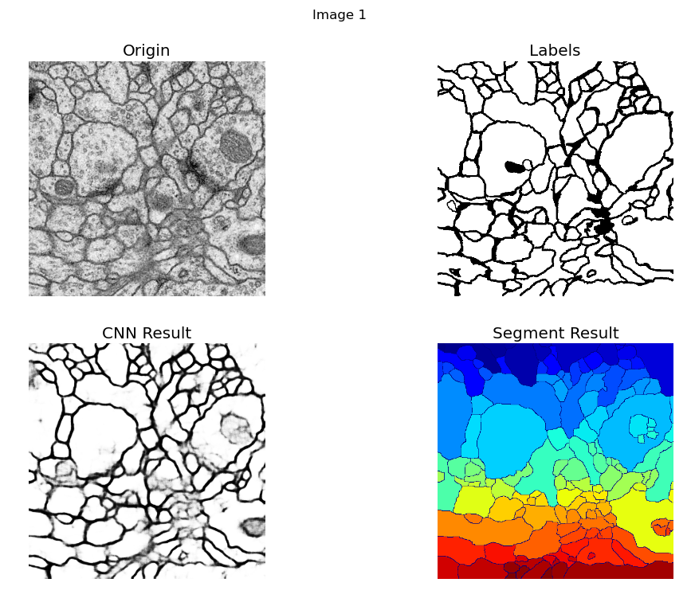

# My research project for ISBI 2012 challenge

This project use CNN to classify each pixel is border or not (binary classifier) with train images, then use the trained models to find the likelihood with test images, then pass the likelihood to do segmentation.

## Pre-requirements

1. [Caffe](http://caffe.berkeleyvision.org/), follow the install instruction, if it isn't in your machine. 
2. [The images of ISBI 2012 challenges](http://brainiac2.mit.edu/isbi_challenge/home), download the images and place them in ./data folder
3. Python 2.7 with numpy, tifffile, lmdb, sklearn and matplotlib packages
4. Java 8

To start, you can just type 
```bash
python all.py
```

the program will ask you which model do you want to run. Or you can give the specific model. 
```bash
python all.py --model={model}
```

the rule of finding model is ./models/{model}/config.json where {model} is the value you input.

## Tasks
1. Convert.py, mirror and tile images to LMDB for Caffe.
2. Train.py, run Caffe train with data generated from task 1
3. Deploy.py, run Caffe classifer with trained-model generated from task 2.
4. Segment.py, run segmentation with likelihood generated from task 3.
5. Evaluation.py, run a java library to evaluate results from task 4.

All.py is just run all tasks together.

The execution log will be written in place of /models/{model}/results/{time}.log 

## Show Results
you can run Show.py to visualize results and use key ← and key → to switch images.


## Acknowledge

Adviser: Dr. Chao Chen

## Caution
The Segment code is writen by another team in C++, so it doesn't include in this repo(I might or might not change it to python). Also, this project is for learning, so the quality might not be good. 
 
## References

1. https://github.com/mjpekala/bio-segmentation
2. [Deep models for brain EM image segmentation: novel insights and improved performance.](https://www.ncbi.nlm.nih.gov/pubmed/27153603)
3. [Segmentation evaluation after border thinning](http://imagej.net/Segmentation_evaluation_after_border_thinning_-_Script)